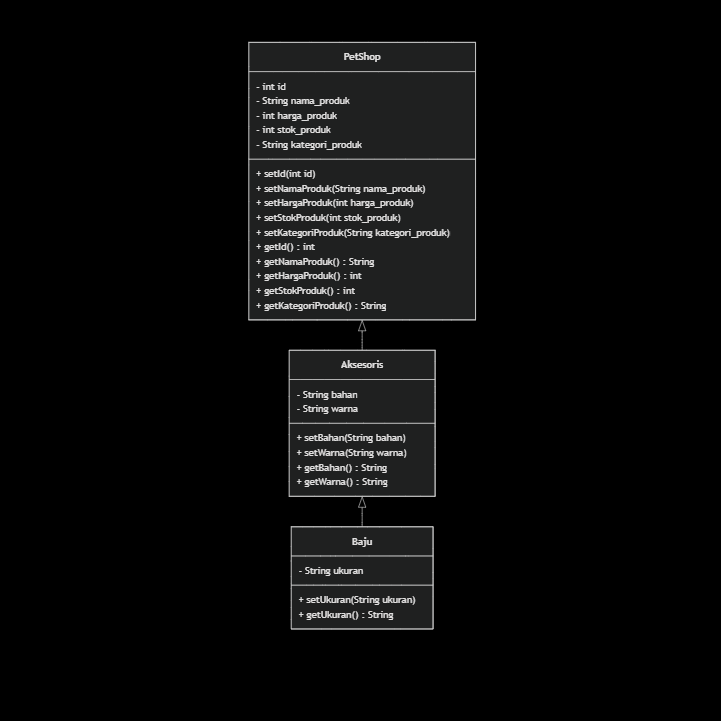
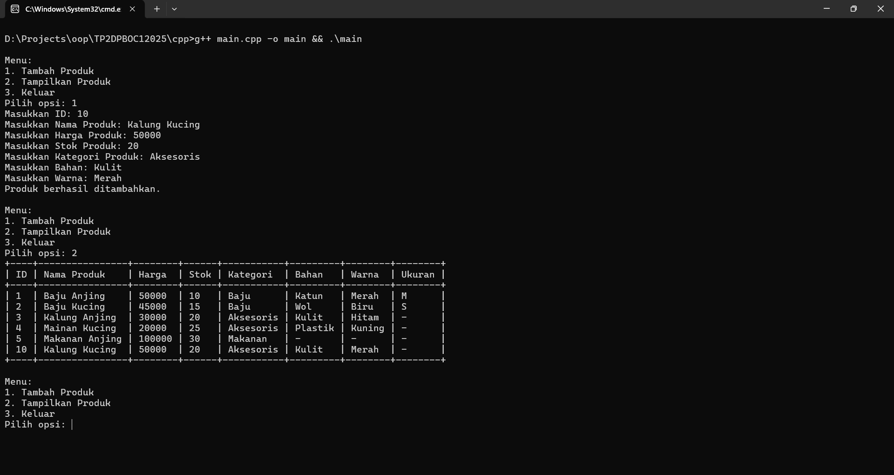
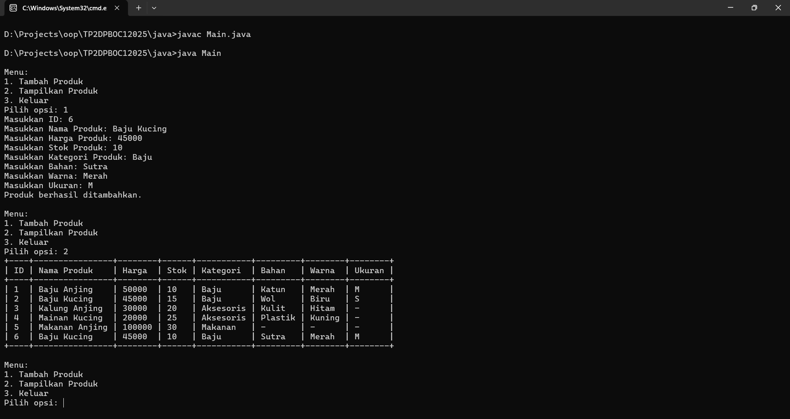
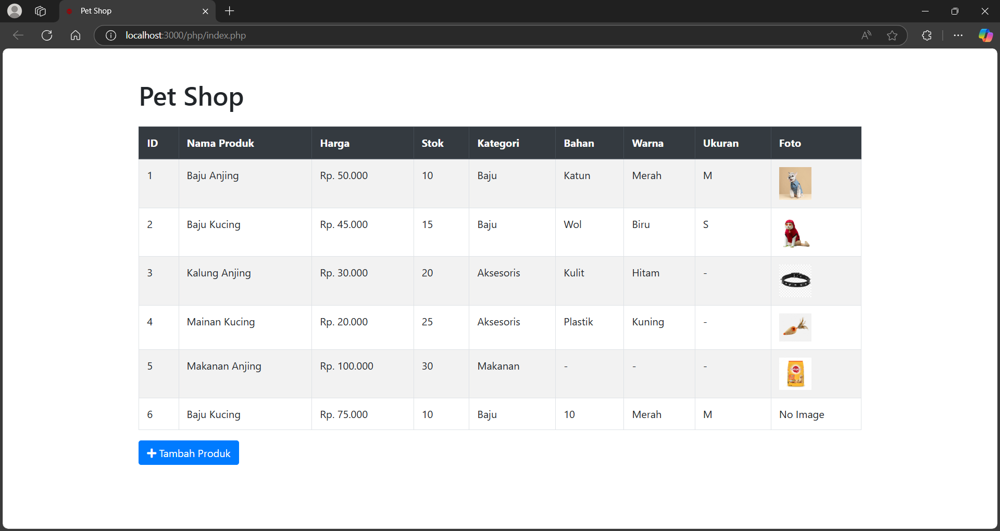
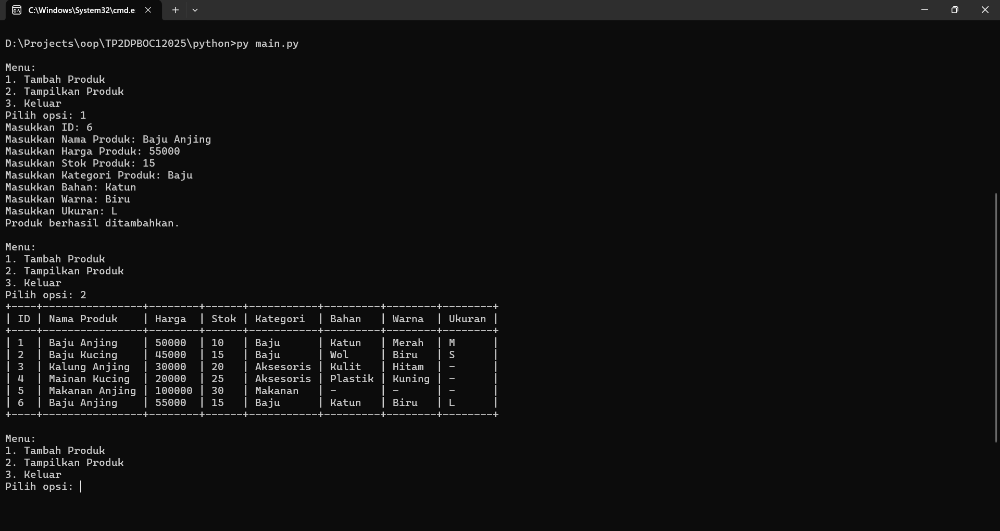

# Desain dan Pemrograman Berbasis Objek

---

## Tugas Praktikum 2

---

### Janji

---

Saya Fariz Wibisono dengan NIM 2307589 mengerjakan Tugas Praktikum 2 dalam mata kuliah Desain dan Pemrograman Berorientasi Objek untuk keberkahanNya maka saya tidak melakukan kecurangan seperti yang telah dispesifikasikan. Aamiin.

### Dokumentasi

---

#### Diagram Kelas

Berikut adalah diagram kelas yang menggambarkan struktur dan hubungan antar kelas dalam proyek ini:

#### Bahasa Pemrograman

---

Proyek ini diimplementasikan dalam beberapa bahasa pemrograman. Berikut adalah hasil run kode di setiap bahasa:

1.  **C++**
   

2.  **Java**
   

3.  **PHP**
   

4.  **Python**
   

#### Penjelasan Kelas, Atribut, dan Metode

---

Berikut adalah penjelasan rinci mengenai kelas, atribut, dan metode yang dibuat dalam proyek ini:

1.  **Kelas**

    - **PetShop**
      - Kelas dasar yang mendefinisikan produk di petshop. Kelas ini digunakan sebagai dasar untuk semua produk yang dijual di petshop.
    - **Aksesoris**
      - Kelas turunan dari PetShop yang menambahkan atribut khusus untuk aksesoris. Ini memungkinkan kita untuk memperluas fungsionalitas PetShop dengan atribut tambahan yang relevan untuk aksesoris.
    - **Baju**
      - Kelas turunan dari Aksesoris yang menambahkan atribut khusus untuk baju. Ini memungkinkan kita untuk lebih spesifik dalam mendefinisikan produk baju dengan atribut tambahan yang relevan.

2.  **Atribut**

    - **PetShop**
      - `id`: Menyimpan ID produk. ID ini penting untuk mengidentifikasi setiap produk secara unik.
      - `nama_produk`: Menyimpan nama produk. Nama produk digunakan untuk menampilkan dan mengidentifikasi produk.
      - `harga_produk`: Menyimpan harga produk. Harga produk diperlukan untuk transaksi penjualan.
      - `stok_produk`: Menyimpan stok produk. Stok produk digunakan untuk melacak ketersediaan produk.
      - `kategori_produk`: Menyimpan kategori produk. Kategori produk membantu dalam mengelompokkan produk berdasarkan jenisnya.
    - **Aksesoris**
      - `bahan`: Menyimpan bahan aksesoris. Bahan penting untuk menentukan kualitas dan jenis aksesoris.
      - `warna`: Menyimpan warna aksesoris. Warna digunakan untuk variasi produk dan preferensi pelanggan.
    - **Baju**
      - `ukuran`: Menyimpan ukuran baju. Ukuran penting untuk memastikan baju sesuai dengan kebutuhan pelanggan.

3.  **Metode**
    - **Setter dan Getter**:
      - `setId(int id)`: Mengatur ID produk. Metode ini digunakan untuk menetapkan ID unik untuk setiap produk.
      - `setNamaProduk(String nama_produk)`: Mengatur nama produk. Metode ini digunakan untuk menetapkan nama produk.
      - `setHargaProduk(int harga_produk)`: Mengatur harga produk. Metode ini digunakan untuk menetapkan harga produk.
      - `setStokProduk(int stok_produk)`: Mengatur stok produk. Metode ini digunakan untuk menetapkan jumlah stok produk.
      - `setKategoriProduk(String kategori_produk)`: Mengatur kategori produk. Metode ini digunakan untuk menetapkan kategori produk.
      - `getId()`: Mengambil ID produk. Metode ini digunakan untuk mendapatkan ID produk.
      - `getNamaProduk()`: Mengambil nama produk. Metode ini digunakan untuk mendapatkan nama produk.
      - `getHargaProduk()`: Mengambil harga produk. Metode ini digunakan untuk mendapatkan harga produk.
      - `getStokProduk()`: Mengambil stok produk. Metode ini digunakan untuk mendapatkan jumlah stok produk.
      - `getKategoriProduk()`: Mengambil kategori produk. Metode ini digunakan untuk mendapatkan kategori produk.
      - `setBahan(String bahan)`: Mengatur bahan aksesoris. Metode ini digunakan untuk menetapkan bahan aksesoris.
      - `setWarna(String warna)`: Mengatur warna aksesoris. Metode ini digunakan untuk menetapkan warna aksesoris.
      - `getBahan()`: Mengambil bahan aksesoris. Metode ini digunakan untuk mendapatkan bahan aksesoris.
      - `getWarna()`: Mengambil warna aksesoris. Metode ini digunakan untuk mendapatkan warna aksesoris.
      - `setUkuran(String ukuran)`: Mengatur ukuran baju. Metode ini digunakan untuk menetapkan ukuran baju.
      - `getUkuran()`: Mengambil ukuran baju. Metode ini digunakan untuk mendapatkan ukuran baju.
    - **Konstruktor dan Destruktor**:
      - `PetShop()`: Konstruktor default. Konstruktor ini digunakan untuk membuat objek PetShop tanpa parameter.
      - `PetShop(int id, String nama_produk, int harga_produk, int stok_produk, String kategori_produk)`: Konstruktor dengan parameter. Konstruktor ini digunakan untuk membuat objek PetShop dengan parameter yang ditentukan.
      - `~PetShop()`: Destruktor virtual. Destruktor ini digunakan untuk membersihkan sumber daya yang digunakan oleh objek PetShop.
      - `Aksesoris()`: Konstruktor default. Konstruktor ini digunakan untuk membuat objek Aksesoris tanpa parameter.
      - `Aksesoris(int id, String nama_produk, int harga_produk, int stok_produk, String kategori_produk, String bahan, String warna)`: Konstruktor dengan parameter. Konstruktor ini digunakan untuk membuat objek Aksesoris dengan parameter yang ditentukan.
      - `~Aksesoris()`: Destruktor. Destruktor ini digunakan untuk membersihkan sumber daya yang digunakan oleh objek Aksesoris.
      - `Baju()`: Konstruktor default. Konstruktor ini digunakan untuk membuat objek Baju tanpa parameter.
      - `Baju(int id, String nama_produk, int harga_produk, int stok_produk, String kategori_produk, String bahan, String warna, String ukuran)`: Konstruktor dengan parameter. Konstruktor ini digunakan untuk membuat objek Baju dengan parameter yang ditentukan.
      - `~Baju()`: Destruktor. Destruktor ini digunakan untuk membersihkan sumber daya yang digunakan oleh objek Baju.

Penjelasan di atas mencakup fungsi dari masing-masing atribut serta metode yang dibuat dalam proyek ini. Atribut dan metode ini saling berkorelasi untuk memastikan bahwa setiap produk di petshop dapat diidentifikasi, dikategorikan, dan dikelola dengan baik. Pastikan untuk melihat gambar hasil run kode di setiap bahasa untuk memahami implementasi lebih lanjut.
